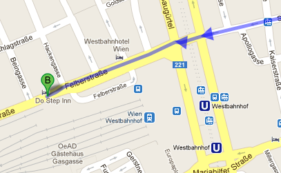
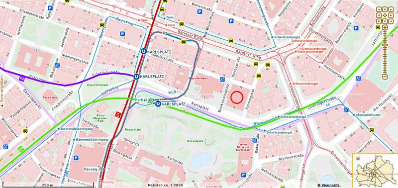
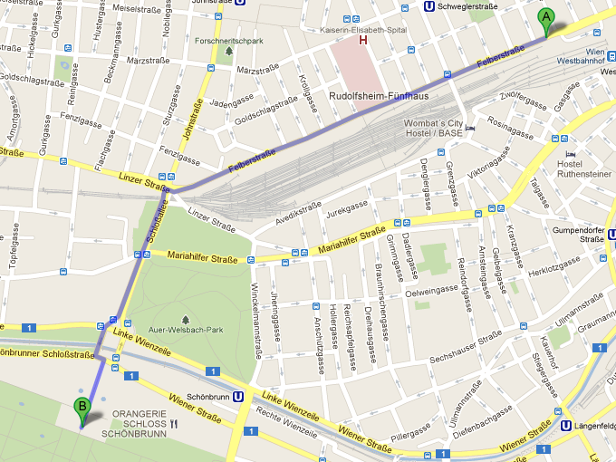
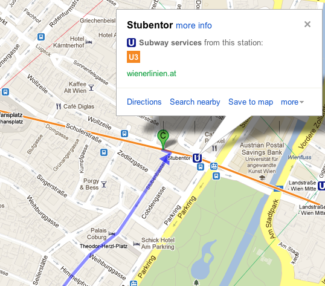
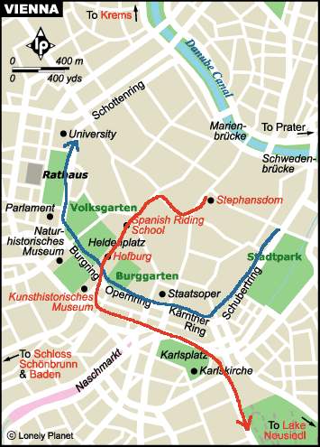
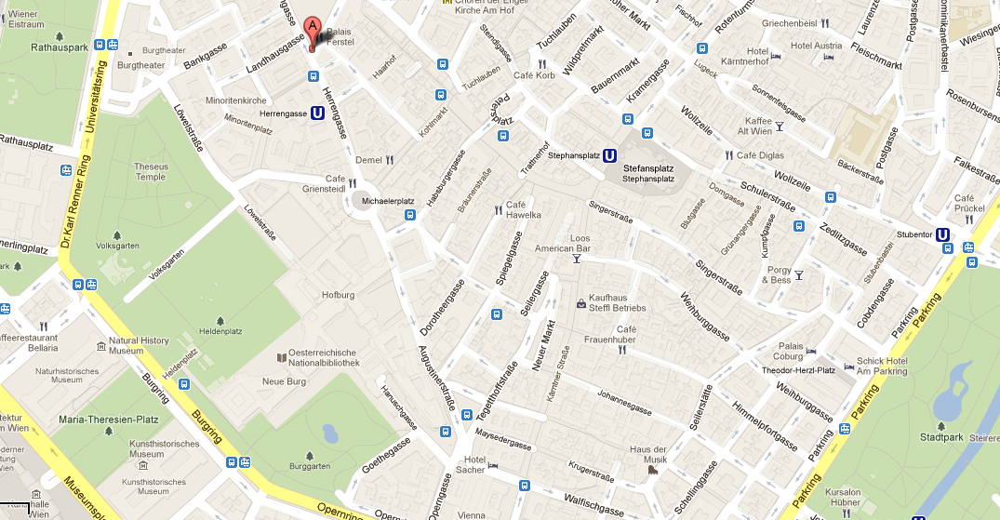
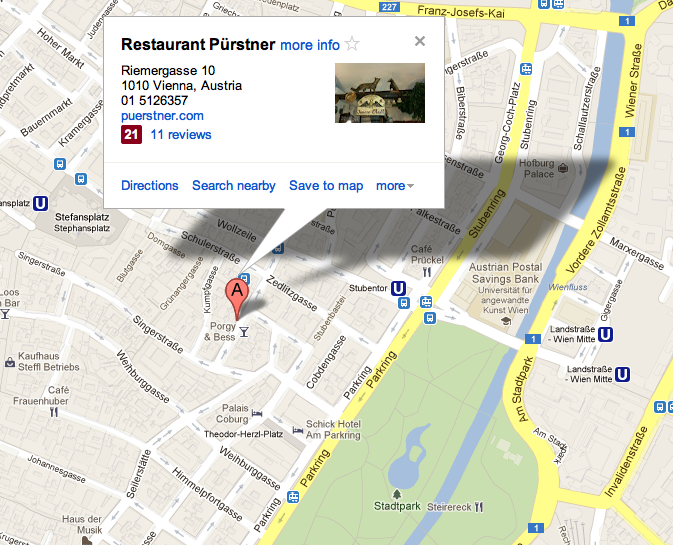

#Vienna
----
##交通
*  [市内交通查询，google maps无路线](http://www.wienerlinien.at/eportal/ep/home.do?tabId=0)

##Schedule
###Sep 27
####*13:00* Arrive
**Vienna, VIB,U3 Stat.Erdberg**   

	Erdberg --Metro U3-- Westbahnhof  
	Westbahnhof an Wien, Felberstraße 20
	

####*14:00* Checkin
**Do Step Inn @ Felberstrasse 20, Vienna, 1150, Austria**  

>Beingasse Straßenbahn 
>Dr.-Karl-Renner-Ring Dr.-Karl-Renner-
>Dr.-Karl-Renner-Ring Straßenbahn D  
>Kärntner Ring/Oper Südbahnhof S   

####*15:00* 奥地利国家美术馆(在维也纳上美景宫[Belvedere](http://www.belvedere.at/en)) 
    Upper Belvedere
    Prinz Eugen-Straße 27, 1030 Wien
    Plane Wien Schwechat: Bus, to stop “Südbahnhof “
    Train to stop “Südbahnhof “
    Tram D, to stop “Schloss Belvedere”
    Tram 18, 0, to stop “Südbahnhof”
    Bus 13A, 69A, to stop “Südbahnhof”
    Underground U1, to stop “Südtirolerplatz” 

* [Klimt的代表作"吻"](http://bbs.qyer.com/viewthread.php?tid=26859&forum=19#forumpost234578)  
* [奥地利国家美术馆](http://cavefoswimmers.blogbus.com/logs/33104286.html)  
* [Jubilee Exhibition: 150 Years Gustav Klimt](http://www.belvedere.at/en/ausstellungen/aktuelle-ausstellungen/jubilee-exhibition-e11742)  
在美景宫前坐有轨电车71路，到Zentralfriedhof 2.Tor，参观中央公墓，里面有贝多芬、莫扎特、大小斯特劳斯等人的墓。

#####*18:00* IMPERIAL TORTE  
####*19:00* 金色大厅音乐会
    

    You can reach the Musikverein with the following means of public transport:
    Underground: U1, U2, U4 station Karlsplatz / Oper
    Tram: 1, 2, D, 62 station Kärntner Ring / Oper
    71 last stop Schwarzenbergplatz
    Bus: 59A, 2A station Kärntner Ring / Oper 4A station Karlsplatz
    Wiener Lokalbahnen (Badner Bahn) last stop Kärntner Ring / Oper

	金色大厅不一样，卖票和入场是两个口。如果已经订了票，记得不要走到卖票的那个口去傻等。到金色大厅后，先去柜台凭打印的付款凭证换票，然后马上入场。
	Karlskirche  
####*21:00* 回酒店

----
### Sep 28
####*07:30* [美泉宫](www.schoenbrunn.at) （申布伦宫）  
    

    沿着铁路线步行到美泉宫。
    25分钟后，往左拐过一铁路宽大的桥墩子，眼前一片开阔，硕大的草坪，成片的树林，朝霞辉映下的宫殿已经远远地呈现在眼前了。
	Schönbrunn Palace, Schloß Schönbrunn, 1130 Vienna, Austria
	U4: Sch鰊brunn U4, Tram 10, 58, 60: Hietzing 
	Grand Tour with audio guide: 11,50 Euro ; with guide:14 Euro 
	tel. 811 13 
	April - June, Sept., Oct.: daily 8:30 a.m.-5 p.m. 
	July, Aug.: daily 8:30 a.m.-6 p.m. 
	Nov. - March: daily 8:30 a.m.-4:30 p.m. 
	
####*12:00* Lunch [www.plachutta.at/](plachutta)    

    

    U3 Stubentormore
    Plachutta Wollzeile
    Wollzeile 38 
    1010 Vienna, Austria 
    Tel: 01/512 15 77

####*13:00* Route1 环城景观        
   
蓝线

(2)完毕后，搭乘U4到Stadtpark站，参观城市公园。公园内有各大音乐家的雕像，最著名的是维也纳重要地标“金色施特劳斯像”。  
(3)完毕后，搭乘有轨电车1路或D路，到Oper站，瞻仰一下国家歌剧院（Oper）。    
4)接下来，步行参观环线上的重要景点，大致路线为：Opering、Burgring、Dr-Karl-Renner-Ring、Dr-Karl-Lueger-Ring。一路会途经：
  

Burggarten  

* 新堡（Neuburg）    
* 英雄广场（Heldenplatz）    
* 皇宫（Hofburg），皇宫建筑稍靠近老城内部，所以先不要进入皇宫参观，在Route 2时再进。    
* 艺术史博物馆（Kunsthistorisches Museum）与自然史博物馆（Naturhistorisches Museum)    
* 国会（Parlament）    
* 人民公园（Volksgarten）    
* 市政厅（Rathaus）    
* 城堡剧院（Burgtheater）    
* 维也纳大学（Universit鋞）  
>U2地铁站 ”Schottentor - Universitaet”  
里面感觉真的很有历史的气息，尤其是1楼的走廊里，很多著名科学家的头像，让人肃然起敬。在主楼里转完后，往前走走，就到了市政厅（Rathaus）  
>世界上现存最大，最古老的德语大学。许多著名科学家曾经在这里工作和研究，如薛定鄂，佛洛伊德，多普勒，卡尔波普等（大学里有一个专门的长廊陈列着他们的塑像）   
可以的，周1-6，免费参观。不过，里面很大，不熟，没标识，出名的大礼堂、地下室，庭院的喷泉，以及其他地方介绍图片上的排列很有特色的楼梯没找到。
* 感恩堂（Votivkirche）    
>维也纳大学和沃帝夫教堂仅一条马路相隔，再往北，经过弗洛伊德博物馆，大概将近1公里距离，就能见到一座美丽的教堂。
虽然这座美丽的教堂有些偏僻，但很值得一看，它是早期巴洛克风格，于1651年修建。教堂里面有用拉毛粉饰法制做得装饰盒壁画。主祭坛右边的那个13世纪的十字架原先立在Schlickplatz的公共刑场上，被称为绞刑十字架。
该教堂也是免费参观的。每天早9点-晚22点。

####*16:30* Café Central    
    
Café Central, Herrengasse, Vienna, Austria

####*19:00* Dinner    Purstner餐厅的一尺长猪肋排  

>一家有点摇滚乡村风格的餐厅，服务生很幽默风趣给你主动打招呼。一尺长的猪肋排更是人见人爱的美食。如果胃口小一点的女生两个人要一份就够了（好像是13欧左右），还送一小碗菜丝沙拉和烤土豆。俺们在艺术史博物馆暴走5个小时之后来这里看到香喷喷的猪肋排，刚上桌就已经内牛满面了！！！  
地址：Riemergasse 10, Vienna 1010。比较近的地铁站是U3的Stubentor和Stephansplatz站。

----
### Sep 29
####*10:00* [艺术史博物馆 Kunsthistorisches Museum](http://www.khm.at/en/)  
[票价](http://www.khm.at/en/plan-your-visit/kunsthistorisches-museum/entrance-fees/): 12欧  

[全世界第四大艺术博物馆，下辖8个分馆，分别为：本馆，民族学博物馆，奥地利戏剧博物馆，新霍夫堡皇宫，马车城堡，皇室珍宝馆，忒修斯神殿，阿姆布拉斯宫。本馆藏品以7000余件绘画作品为重点，主要是从哈布斯堡家族长期统治的欧洲各国搜集而来，其次是从古埃及、古希腊、古罗马到18世纪的雕塑、工艺及硬币等各类艺术品，总数达40万件。](http://bestfoto.blog.163.com/blog/static/172642035201256111337388/?yishu)  

    To reach the museum from the Westbahnhof
    Take subway train U3 to the Volkstheater station.
    To reach the museum from the Südbahnhof
    Take street car D to the Burgring/Kunsthistorisches Museum stop.
    Public transportation
    U2, U3, D, 1, 2, 2A, 57A
    Information about closing days
    Tel. +43 1 525 24- 4025

	Maria-Theresien-Platz, 1010 Wien
	Opening hours
	Tuesday - Sunday
	10 a.m. to 6 p.m.
	Thursday 10 a.m. to 9 p.m.
	(Coin cabinet closes at 6 p.m.)
	U2: MuseumsQuartier；U3: Volkstheater ；tram D, J, 1, 2, bus 2A, 57A: Burgring   
	
###*13:00* [国立图书馆](http://www.onb.ac.at/ev/services/prices.htm) Family card       
布鲁克公园  
美术史博物馆和自然史博物馆  
市立公园(小斯特劳斯像，舒伯特像，贝多芬像)
####*15:00* 凯隆特纳大街Karntner Str（包括Stephan教堂，国立歌剧院）
	1., Stephansplatz 
	U1, U3: Stephansplatz 
	tel. 515 52 - 3526 
####*18:30* Figlmüller Wollzeile Restaurant
### Sep 30
####*07:00* Check out

----
##TODO  
Café Central, Herrengasse, Vienna, Austria  

	Imperial Palace – Hofburg 霍夫堡皇宫

	推荐度：☆☆☆☆☆
	U1, U3: Stephansplatz, U3: Herrengasse, U2, U3: Volkstheater, Bus 48A: Dr.-	Karl-Renner-Ring, Tram D, J, 1, 2, Bus 57A: Burgring 
	Price: 8,90 euro ;Guided tours:  11,40 Euro (下纳多个景点，套票包含：Imperial 	Apartments; Imperial Silver Collection; Secular and Ecclesiastical Treasuries等)
	www.hofburg-wien.at
	
####多瑙河
>交通：坐U1到Donauinsel站下	

奥地利国会大厦以它最著名的特色——雅典娜雕像和喷泉，成为维也纳知名的旅游景点。  
[maps](http://goo.gl/maps/1bHBr)  
[www.leopoldmuseum.org](http://www.leopoldmuseum.org/en)  

##ref:  
[交通卡](http://www.wienerlinien.at/eportal/ep/programView.do/pageTypeId/10220/programId/11062/channelId/-8366) 14.5  
[维也纳卡](http://www.weiyena.info/vienna_card.html) 19.9

<https://maps.google.com/maps?saddr=Eurolines+Austria,+Erdbergstra%C3%9Fe+200A,+1030+Vienna,+Austria&daddr=Felberstrasse+20,+Vienna,+1150,+Austria+to:Belvedere+Palace,+Prinz-Eugen-Stra%C3%9Fe,+Vienna,+Austria+to:Secession+to:St.+Charles's+Church,+Kreuzherrengasse,+Vienna,+Austria+to:Wiener+Philharmoniker,+B%C3%B6sendorferstra%C3%9Fe+12+1010+Wien,+%C3%96sterreich+to:Caf%C3%A9+Central,+Herrengasse,+Vienna,+Austria+to:Restaurant+P%C3%BCrstner,+Riemergasse,+Wien,+%C3%96sterreich+to:Nationalbibilothek+to:Caf%C3%A9+Sacher,+Philharmonikerstra%C3%9Fe,+Vienna,+Austria+to:Hofburg+Palace,+Vienna,+Austria+to:Kunsthistorisches+Museum+to:Stephansplatz,+Wien,+%C3%96sterreich+to:Hofburg+to:Opering+to:Wiener+Rathaus,+Rathausplatz,+Vienna,+Austria&hl=en&ie=UTF8&sll=48.20329,16.374245&sspn=0.052858,0.153809&geocode=FaFV3wIdR3X6ACG4Du5nqJxUIClpV1vwUAdtRzG4Du5nqJxUIA%3BFWRu3wIdhT35ACnJ0Rho9gdtRzGGru9B0iUSwA%3BFaxW3wIdyO_5ACG1HCRoNJ1cgCnR_0ECfQdtRzG1HCRoNJ1cgA%3BFeh03wIdscj5ACESWKnSoDOZHin93u8_ZQdtRzESWKnSoDOZHg%3BFSBy3wIdytD5ACEy9WbcvKWrzinHahaCggdtRzEy9WbcvKWrzg%3BFS183wIdiNT5ACHWdTqzxJQjMSnHNrtFnQdtRzHWdTqzxJQjMQ%3BFYGh3wIdYbf5ACFJLkL7P4f6WykvOwz3lwdtRzFJLkL7P4f6Ww%3BFYiU3wIdouL5ACFHIgC81hcnBCnj0DIzngdtRzFHIgC81hcnBA%3BFS6R3wIdmrz5ACFHb7QGxvndVyn1IydjmQdtRzFHb7QGxvndVw%3BFYqI3wIdscf5ACGlhtv1jMoNyCkjznBunAdtRzGlhtv1jMoNyA%3BFYWV3wIdo7T5ACHjrKpjwfWaDynfBiC_mQdtRzHjrKpjwfWaDw%3BFY-I3wIdLqj5ACGFp662b1GUqinxd89jmgdtRzGFp662b1GUqg%3BFQKZ3wIdTtT5ACmh_IE-nwdtRzHeH6pWwWMFAg%3BFYWV3wIdo7T5ACHjrKpjwfWaDynfBiC_mQdtRzHjrKpjwfWaDw%3BFQGE3wIdErz5ACF6Fr4sh_64Nind9ultmwdtRzF6Fr4sh_64Ng%3BFVqj3wIdXpv5ACF4obL54tHNpynzitvelQdtRzF4obL54tHNpw&oq=Rathaus&mra=ls&t=m&z=15>        
[维也纳的博物馆和主要景点](http://bbs.qyer.com/viewthread.php?tid=24891&extra=&page=1)  
[东欧慢摇 - 萨尔茨堡Hallstatt维也纳完整版(交通住宿景点行程)](http://bbs.qyer.com/viewthread.php?tid=473094&extra=&authorid=153566&page=1)  